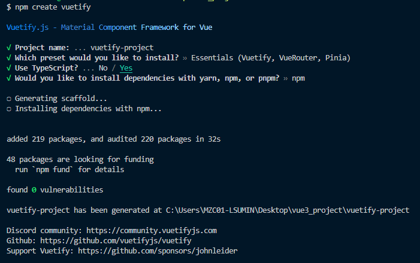

## Vue3 + Vuetify3 + Vite + Pinia + Typescript

Vue2 기반으로 운영중인 프로젝트를 새로 개편하면서<br/>
Vue3 기반으로 프로젝트 구조를 새롭게 세팅하기로 했다.<br/>
기존에는 디자인이 더 세련된 Vuexy 템플릿을 사용했는데<br/>
우리 팀에 디자이너 분이 들어오시면서<br/>
지속적으로 업데이트가 되고있는 Vuetify3 프레임워크를 사용하여 개발하기로 했다.<br/>

Vue3 프로젝트 생성 후 Vuetify 설치를 해보았으나 Vuetify component를 가져오지 못했다.<br/>
여러가지 순서로 시도를 해보았는데<br/>
바로 Vuetify 프로젝트 생성으로 생성했을 때 내가 원하는 환경 구성이 세팅되었다.

***

### ✅ 환경구성 요구사항

|---|---|
|Script 프레임워크|Vue3|
|UI 프레임워크|Vuetify 3|
|빌드도구|Vite|
|상태관리|Pinia|
|Node|18.16.0|
|타입스크립트|적용|
|구동방식|CSR|

***

### ✅ Vue 프로젝트 세팅하기

#### 1. Node, Vue, Vue CLI, VSCode Plugin

vscode, node, vue, vue cli가 설치되어 있어야합니다

🔽vscode extention 설치
-Typescript Vue Plugin(Volar)
-Vue3 snippets
-HTML CSS Support
저는 이 3개를 설치했습니다

(각 extention별 역할 추가)

#### 2. Vuetify 프로젝트 생성

🔽 Vuetify3 공식사이트
[Vuetify Install](https://vuetifyjs.com/en/getting-started/installation/)



```bash
npm create vuetify
```



option 선택



***
