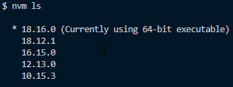

## Vue3 + Vuetify3 + Vite + Pinia + Typescript

Vue2 기반으로 운영중인 프로젝트를 새로 개편하면서
Vue3 기반으로 프로젝트 구조를 새롭게 세팅하기로 했다.
기존에는 디자인이 더 세련된 Vuexy 템플릿을 사용했는데
우리 팀에 디자이너 분이 들어오시면서
지속적으로 업데이트가 되고있는 Vuetify3 프레임워크를 사용하여 개발하기로 했다.

Vue + Vite 프로젝트 구성 후 Vuetify 설치를 해보았으나 Vuetify component 에러
여러가지 순서로 시도를 해보았는데
Vuetify 프로젝트를 바로 세팅했을 때 내가 원하는 환경구성이 다 맞게 세팅이 되었다.

***

### ✅ 환경구성 요구사항

|Script 프레임워크|Vue3|
|UI 프레임워크|Vuetify 3|
|빌드도구|Vite|
|상태관리|Pinia|
|Node|18.16.0|
|타입스크립트|적용|
|구동방식|CSR|

#### 1. Node 설치

🔽Node.js 공식홈페이지
https://nodejs.org/ko

저는 이미 Node가 설치되어있어 이 과정은 생략했습니다.
저는 nvm(Node version Manager)를 사용하여 프로젝트마다 버전을 바꿔가며 사용하고 있는데요

🔽현재 node 버전 확인하기



```bash
node -v
```



🔽설치되어있는 node 버전 리스트 보기



```bash
nvm ls
```





🔽node 버전 바꾸기



```bash
nvm use 18.16.0
```



현재 최적화된 버전인 18.16.0 버전을 사용해보겠습니다.

***
