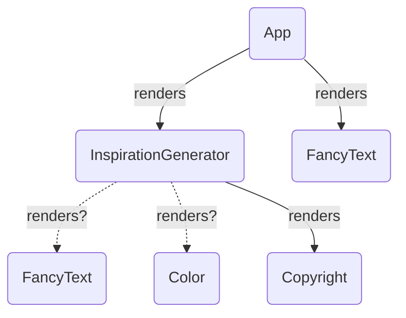
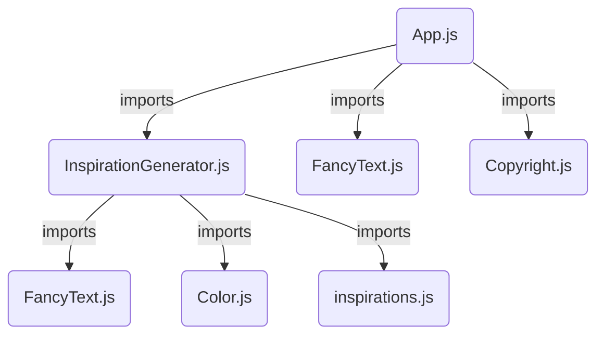

## 리액트 컴포넌트 렌더링하기

- 조건부 렌더링
- 리스트 렌더링
- 컴포넌트를 순수하게 유지하기
- 트리로서의 UI

[리액트v19 공식문서-UI 표현하기] <https://ko.react.dev/learn/describing-the-ui>

---

## 조건부 렌더링

### 조건부로 JSX 반환하기

#### (1) `if` 연산자 사용하기

```jsx
if (isPacked) {
  return <li className="item">{name} ✅</li>;
}
return <li className="item">{name}</li>;
```

<br/>

#### (2) `null` 사용해 아무것도 반환하지 않기

- null을 반환하면 아무것도 렌더링되지 않음

```jsx
if (isPacked) {
  return null;
}
return <li className="item">{name}</li>;
```

<br/>

#### (3) `? :`삼항 조건 연산자, `&&` 사용해 간단하게 표현하기

```jsx
if (isPacked) {
  return <li className="item">{name} ✅</li>;
}
return <li className="item">{name}</li>;
```

⬇ 삼항 조건 연산자 `? :` 사용

```jsx
return <li className="item">{isPacked ? name + " ✅" : name}</li>;
```

⬇️ 논리 AND 연산자 `&&` 사용

- isPacked가 true면 ✅ 를 렌더링하고, false면 아무것도 렌더링 하지 않음
- `주의` && 왼쪽에 숫자 0이 오면 ‘0’ 자체를 렌더링함

```jsx
return (
  <li className="item">
    {name} {isPacked && "✅"}
  </li>
);
```

> 💡 JSX 요소는 내부 상태를 가진 객체가 아니고 “렌더링 설명서(blueprint)”일 뿐이다. JSX에 작성한 태그들은 실제 DOM요소가 아니다. 실제 DOM 요소는 리액트가 이 설명서를 바탕으로 렌더링할 때 브라우저에서 생성된다.

<br/>

#### (4) 변수에 조건부로 JSX 할당하기

```jsx
function Item({ name, isPacked }) {
  let itemContent = name;
  if (isPacked) {
    // JSX 표현식을 변수에 할당할 수 있음
    itemContent = <del>{name + " ✅"}</del>;
  }
  return <li className="item">{itemContent}</li>;
}

export default function PackingList() {
  return (
    <section>
      <Item isPacked={true} name="Space suit" />
    </section>
  );
}
```

---

## 리스트 렌더링

### 배열 데이터를 컴포넌트로 렌더링하기 : `map()`

```jsx
const animals = ["rabbit", "tiger", "panda"];

export default function List() {
  const listItems = animals.map((animal, idx) => <li key={idx}>{animal}</li>);
  return <ul>{listItems}</ul>;
}
```

### 배열 항목들을 필터링해 특정 컴포넌트만 렌더링하기: `filter()`

```jsx
const people = [
  {
    id: 0,
    name: "Creola",
    profession: "mathematician",
  },
  {
    id: 1,
    name: "Mario",
    profession: "chemist",
  },
  {
    id: 2,
    name: "Mohammad",
    profession: "physicist",
  },
  {
    id: 3,
    name: "Percy",
    profession: "chemist",
  },
];

export default function List() {
  // filter()로 profession === 'chemist' 만 필터링 *새로운 배열 반환*
  const chemists = people.filter((person) => person.profession === "chemist");

  // map()으로 필터링된 배열을 JSX 요소로 반환
  const listItems = chemists.map((person) => (
    <li key={person.id}>
      {person.name}: {person.profession}
    </li>
  ));

  return <ul>{listItems}</ul>;
}
```

> 💡 화살표 함수에서 return문 없이 반환할 수 있다. ⇒ 뒤에 중괄호가 오는 경우는 return을 명시해야한다.

<br/>

```jsx
const listItems = chemists.map((person) => (
  <li key={person.id}>
    {person.name}: {person.profession}
  </li>
));
// 또는 아래처럼 작성
const listItems = chemists.map((person) => {
  return (
    <li key={person.id}>
      {person.name}: {person.profession}
    </li>
  );
});
```

### 리스트 아이템에는 `Key`를 지정해야 함!

#### (1) key 역할

배열 항목의 정렬이나 삽입, 삭제가 되어 위치가 변경되더라도 `key`는 리액트가 생명주기 내내 해당 항목을 식별할 수 있게 함

#### (2) key 소스

- **데이터베이스에서 데이터를 가져오는 경우** `고유한 데이터베이스 key/ID` 사용
- **로컬에서 데이터가 생성되고 유지**되는 경우, `증분 일련번호`나 `crypto.randomUUID()` 또는 `uuid` 같은 패키지 사용

#### (3) key 규칙

- key는 형제 간에 고유해야 함
- key는 변경되어서는 안됨
- <></>에는 key를 지정할 수 없음 → <Fragment></Fragment> 사용

#### (4) key 사용할 때 주의

- 배열의 인덱스를 key로 사용하지 말 것(버그 가능성) → 데이터 기반의 안정적인 ID 사용
- key={Math.random()} 처럼 즉석에서 key를 생성하지 말 것
- key는 prop으로 전달되지 않음
- <></>에는 key를 지정할 수 없음 → <Fragment></Fragment> 사용

```jsx
import { recipes } from './data.js';

function Recipe({ id, name, ingredients }) {
  return (
    <div>
      <h2>{name}</h2>
      <ul>
        {ingredients.map(ingredient =>
          <li key={ingredient}>
            {ingredient}
          </li>
        )}
      </ul>
    </div>
  );
}

export default function RecipeList() {
  return (
    <div>
      <h1>Recipes</h1>
      // *key는 Recipe 컴포넌트에서 반환된 루트<div>가 아닌 <Recipe> 자체에 지정해야 함
      {recipes.map(recipe =>
        <Recipe {...recipe} key={recipe.id} />
      )}
    </div>
  );
}
```

---

## 컴포넌트를 순수하게 유지하기

### 리액트에서 작성되는 모든 컴포넌트는 순수 함수여야 한다

#### 순수함수 ?

- **자기 일만 한다.** → 함수가 외부에 있는 변수나 객체는 변경하지 않는다
- **같은 입력, 같은 출력. →** 같은 입력이면 항상 같은 결과를 준다

⇒ **리액트에서 순수성** : 리액트 컴포넌트에 같은 입력이 주어진다면, 반드시 같은 JSX를 반환한다.

🚫 **순수성 규칙을 위반하는 컴포넌트**

```jsx
let guest = 0;

function Cup() {
  // Cup함수 외부의 변수를 변경하고 있다.
  guest = guest + 1;
  return <h2>Tea cup for guest #{guest}</h2>;
}

export default function TeaSet() {
  return (
    <>
      <Cup />
      <Cup />
      <Cup />
    </>
  );
}
```

- 컴포넌트 바깥에 선언된 guest 라는 변수를 수정하고 있음
- ⇒ 컴포넌트를 여러번 호출하면 각각 다른 JSX를 생성한다.
- 위 코드는 실제로 출력될 때 `guest#2, guest#4, guest#6` 이 출력되는데 이는 `“Strict Mode"`가 개발 중에 컴포넌트 함수를 두 번 호출하기 때문이다.

<br/>

```jsx
import { StrictMode } from 'react'
import { createRoot } from 'react-dom/client'
import './index.css'
import App from './App.tsx'

createRoot(document.getElementById('root')!).render(
  <StrictMode>
    <App />
  </StrictMode>,
)
```

<br/>

✅ **순수한 컴포넌트**

```jsx
function Cup({ guest }) {
  return <h2>Tea cup for guest #{guest}</h2>;
}

export default function TeaSet() {
  return (
    <>
      <Cup guest={1} />
      <Cup guest={2} />
      <Cup guest={3} />
    </>
  );
}
```

- Cup 컴포넌트에서 반환하는 JSX는 props인 `guest`에만 의존하기 때문에 순수하다
- ⇒ `guest`에 같은 값을 넘기면 **항상 같은 JSX를 반환한다.**

<br/>

✅ **순수한 컴포넌트**

```jsx
function Cup({ guest }) {
  return <h2>Tea cup for guest #{guest}</h2>;
}

export default function TeaGathering() {
  // 함수 내부에서 선언된 변수를 변경하는 것은 OK
  let cups = [];
  for (let i = 1; i <= 12; i++) {
    cups.push(<Cup key={i} guest={i} />);
  }
  return cups;
}
```

- TeaGathering 내부에 있는 변수는 같은 렌더링 동안 생성되었기 떄문에 변경하여도 순수성에 위반되지 않는다.

> 🔴 이벤트 핸들러는 순수할 필요가 없다.
> 이벤트 핸들러는 보통 사이드 이펙트를 발생시키긴 하지만, 렌더링 중에 실행되는 것이 아니므로 순수성을 위반하지 않는다.
> useEffect 또한 렌더링 이후 실행되기 때문에, 사이드 이펙트를 발생시켜도 괜찮지만 권장되는 방법은 아니다.

- **사이드 이펙트(Side Effect)란?** 화면을 업데이트하거나, 애니메이션을 시작하거나, 데이터를 바꾸는 것처럼 렌더링 외에 일어나는 일

<br/>

🚫 **순수성 규칙을 위반하는 컴포넌트**

```jsx
export default function StoryTray({ stories }) {
  // props는 읽기 전용 + 외부 변수이므로 직접 수정해서는 안된다
  stories.push({
    id: "create",
    label: "Create Story",
  });

  return (
    <ul>
      {stories.map((story) => (
        <li key={story.id}>{story.label}</li>
      ))}
    </ul>
  );
}
```

<br/>

✅ **순수한 컴포넌트**

```jsx
export default function StoryTray({ stories }) {
  // props를 새로운 배열로 복사
  let storiesToDisplay = stories.slice();

  // 원본 데이터인 stories는 변경되지 않는다
  storiesToDisplay.push({
    id: "create",
    label: "Create Story",
  });

  return (
    <ul>
      {stories.map((story) => (
        <li key={story.id}>{story.label}</li>
      ))}
    </ul>
  );
}
```

---

## 리액트에서 트리를 이용해 요소간의 관계 이해하기

### 렌더 트리

- 리액트에서 컴포넌트들이 실제로 렌더링되는 구조를 나타내는 트리, 리액트는 렌더 트리를 기반으로 화면에 어떻게 표시할지 결정
- 각 노드(컴포넌트)는 부모-자식 관계를 가짐
- 트리 구조는 컴포넌트 간의 관계 이해. 더 나아가 데이터 흐름과 상태 관리를 이해하는데 도움을 준다
- 렌더 트리는 렌더링 최적화와 디버깅 유지보수에도 활용할 수 있다



### 모듈 의존성 트리

- 컴포넌트 간의 모듈 의존성을 나타내는 트리
- 각 노드는 모듈이며, 각 가지는 해당 모듈의 `import`문을 나타낸다.
- 의존성 트리는 앱을 배포하기 위해 필요한 코드를 번들로 묶는 데 빌드 도구에서 사용된다.


